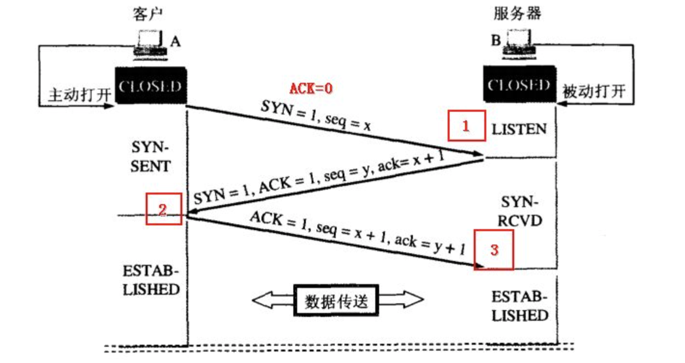
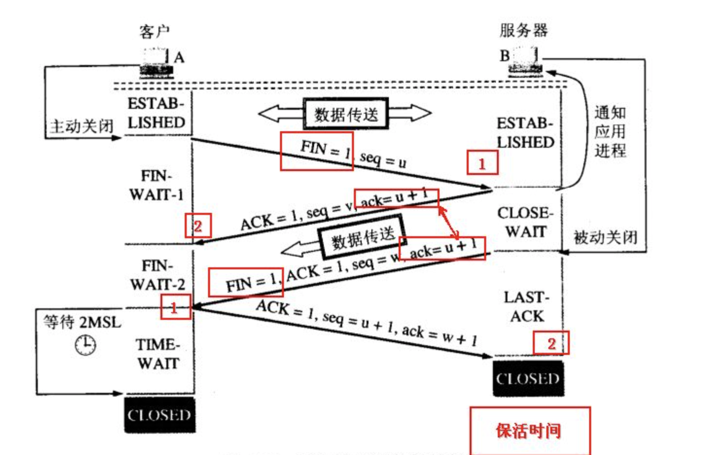

# 计算机网络

## 计算机网络体系结构

### 五层协议

+ 应用层 ：为特定应用程序提供数据传输服务，例如 HTTP、DNS 等协议。
+ 传输层 ：为进程提供通用数据传输服务。由于应用层协议很多，定义通用的传输层协议就可以支持不断增多的应用层协议。运输层包括两种协议：TCP、UDP
+ 网络层 ：为主机、路由器提供数据传输服务。网络层把传输层传递下来的报文段或者用户数据报封装成分组。
+ 数据链路层 ：网络层针对的还是主机之间的数据传输服务，而主机之间可以有很多链路，链路层协议就是为同一链路的主机提供数据传输服务。数据链路层把网络层传下来的分组封装成帧。
+ 物理层 ：考虑的是怎样在传输媒体上传输数据比特流。

### OSI七层

在上述基础上增加了

+ 表示层 ：数据压缩、加密以及数据描述。
+ 会话层 ：建立、管理会话。

### TCP/IP协议（实际使用的）

+ 应用层、TCP/UDP、IP、网络接口层
+ 只有四层，相当于五层协议中数据链路层和物理层合并为网络接口层。

## 传输层

### TCP和UDP

+ 用户数据报协议 UDP（User Datagram Protocol）是无连接的，尽最大可能交付，没有拥塞控制，面向报文（对于应用程序传下来的报文不合并也不拆分，只是添加 UDP 首部），支持一对一、一对多、多对一和多对多的交互通信。
+ 传输控制协议 TCP（Transmission Control Protocol）是面向连接的，提供可靠交付，有流量控制，拥塞控制，提供全双工通信，面向字节流（把应用层传下来的报文看成字节流，把字节流组织成大小不等的数据块），每一条 TCP 连接只能是点对点的（一对一）。

### TCP三次握手

+ 过程

  

  假设 A 为客户端，B 为服务器端。

  首先 B 处于 LISTEN（监听）状态，等待客户的连接请求。

  A 向 B 发送连接请求报文，SYN=1，ACK=0，选择一个初始的序号 x。

  B 收到连接请求报文，如果同意建立连接，则向 A 发送连接确认报文，SYN=1，ACK=1，确认号为 x+1，同时也选择一个初始的序号 y。

  A 收到 B 的连接确认报文后，还要向 B 发出确认，确认号为 y+1，序号为 x+1。

  B 收到 A 的确认后，连接建立。

+ 三次握手原因

  第三次握手是为了防止失效的连接请求到达服务器，让服务器错误打开连接。

  客户端发送的连接请求如果在网络中滞留，那么就会隔很长一段时间才能收到服务器端发回的连接确认。客户端等待一个超时重传时间之后，就会重新请求连接。但是这个滞留的连接请求最后还是会到达服务器，如果不进行三次握手，那么服务器就会打开两个连接。如果有第三次握手，客户端会忽略服务器之后发送的对滞留连接请求的连接确认，不进行第三次握手，因此就不会再次打开连接。

### TCP四次挥手

+ 过程

  

  A 发送连接释放报文，FIN=1。

  B 收到之后发出确认，此时 TCP 属于半关闭状态，B 能向 A 发送数据但是 A 不能向 B 发送数据。

  当 B 完成报文发送后，发送连接释放报文，FIN=1。

  A 收到后发出确认，进入 TIME-WAIT 状态，等待 2 MSL（最大报文存活时间）后释放连接。

  B 收到 A 的确认后释放连接。

+ 四次挥手的原因

    客户端发送了 FIN 连接释放报文之后，服务器收到了这个报文，会进入 CLOSE_WAIT 状态。此时服务器可能还有未发送完成的数据，等到发送完毕之后，服务器会发送 FIN 连接释放报文。

+ TIME_WAIT

    客户端接收到服务器端的 FIN 报文后进入此状态，客户端并不会直接进入 CLOSED 状态，还需要等待2MSL。这么做是为了：

    + 确保最后一个确认报文能够到达。

### TCP可靠传输

超时重传

### TCP滑动窗口

To do

### TCP流量控制

流量控制是端到端的控制，主要解决的是使得接收端来得及处理发送端发来的请求。

该控制是通过控制发送端窗口的大小，从而影响发送方的发送速率。

### TCP拥塞控制

拥塞控制主要考虑的是网络的拥堵情况，目的是保证整体网络的畅通。

首先拥塞有两种情况，超时和收到三次重复的确认报文（接收端每次收到报文都会会对最后一个有序报文进行确认）。

超时说明此时网络已经非常的拥堵。

收到三次重复的确认报文说明网络状况还不是特别差。

+ 慢开始和拥塞避免

最开始cwnd = 1，

+ 快重传和快恢复

## 应用层

### HTTP

### HTTPS

