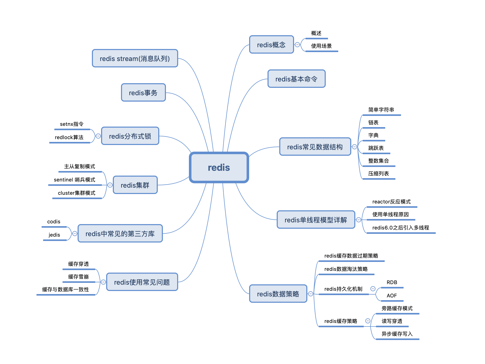
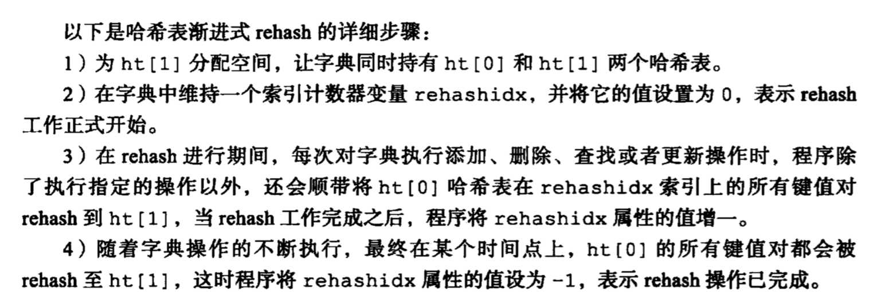

# Redis

## 1.思维导图

## 2.redis基本命令

### [Redis命令](https://www.runoob.com/redis/redis-keys.html)

#### RedisAPI

[RedisAPI](http://redisdoc.com/index.html)

## 3.Redis常见数据结构

## 4.Redis单线程模型详解

## 5.Redis数据策略

### redis缓存数据过期策略

### redis数据淘汰策略

淘汰策略

### redis持久化机制

### redis缓存策略

## 6.Redis使用常见问题

### 1.缓存雪崩

大量key同时过期，导致数据库短时间接受大量请求。

针对 Redis 服务不可用的情况

+ 使用Redis 集群，避免单机问题
+ 限流操作，避免同时大量的请求同时落到数据库

针对热点缓存失效的情况：

+ 随机设置缓存的失效时间
+ 缓存永不失效

### 2.缓存击穿

大量key根本不存在，导致请求落在了数据库上

解决方法

+ 缓存无效key
+ 布隆过滤器

### 3.缓存与数据库一致性问题

## 7.Redis中常见的第三方库

## 8.redis集群

## 9.Redis分布式锁

### 1.使用setnx+expire实现

+ 问题
  + setnx和expire不具有原子性，容易出错

+ 解决方法
  + lua脚本，同时包含setnx和expire两条指令

### 2.使用 set key value [EX seconds][PX milliseconds][NX|XX] 命令

- EX seconds: 设定过期时间，单位为秒
- PX milliseconds: 设定过期时间，单位为毫秒
- NX: 仅当key不存在时设置值
- XX: 仅当key存在时设置值

value值最好具有唯一性。可以使用UUID等方式进行设置。

释放锁时判断一下value值再释放。

分布式情况下可能会出问题。

比如有节点A和节点B，节点A挂掉，尚未同步到节点B。这时出错。

### 3.redlock

具体步骤

假设有5个redis节点

+ 获取当前Unix时间，以毫秒为单位
+ 依次尝试从5个实例，使用相同的key和具有唯一性的value获取锁
  当向Redis请求获取锁时，客户端应该设置一个网络连接和响应超时时间，这个超时时间应该小于锁的失效时间，这样可以避免客户端死等
+ 客户端使用当前时间减去开始获取锁时间就得到获取锁使用的时间。当且仅当从半数以上的Redis节点取到锁，并且使用的时间小于锁失效时间时，锁才算获取成功
+ 如果取到了锁，key的真正有效时间等于有效时间减去获取锁所使用的时间，这个很重要
+ 如果因为某些原因，获取锁失败（没有在半数以上实例取到锁或者取锁时间已经超过了有效时间），客户端应该在所有的Redis实例上进行解锁，无论Redis实例是否加锁成功，因为可能服务端响应消息丢失了但是实际成功了，毕竟多释放一次也不会有问题

[分布式锁](https://juejin.im/post/6844903830442737671)

## 10.Redis事务

## 11.Redis Stream(消息队列)

