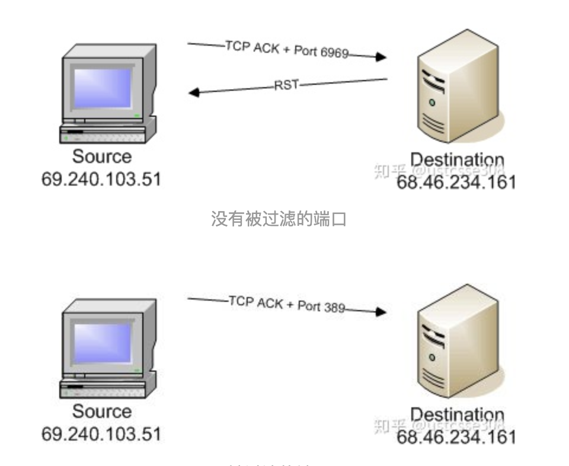

# 信息安全

## ARP协议问题

### ARP协议的作用是什么。

主机广播IP寻找MAC地址，返回单播。

32位IP地址和48位MAC之间的转换。（广播询问，单播答复）

### 引入ARP缓存的功能是什么。

将这一映射关系保存在 ARP 缓存中，使得不必重复运行 ARP 协议。

### ARP缓存中毒的攻击方法和效果是什么。

#### 方法

因为 ARP 缓存中的映射表并不是一直不变的，主机会定期发送 ARP 请求来更新它的 ARP 映射表，利用这个机制，攻击者可以伪造 ARP 应答帧使得主机错误的更新自己的 ARP 映射表，这个过程就是 ARP 缓存中毒。

#### 效果

要么使主机发送 MAC 帧到错误的 MAC 地址，导致数据被窃听；要么由于 MAC 地址不存在，导致主机无法访问实际的服务。

#### 预防

+ 小型网络
  + 静态IP地址和静态ARP映射表。
+ 大型网络
  +  “端口安全” 功能是允许你强制使你的交换机在每个端口只允许 (IP地址对应的) 一个MAC地址通过。这个功能会阻止黑客改变他机器的MAC地址或试图映射多个MAC地址到他的机器上。
+ 一般网络
  + ARP监视工具，比如ARPwatch，当有不正常的ARP通信时它会提醒你。

攻击前需要清除本机ARP缓存

arp -n                  #查看arp表
arp -d address          #删除一个arp表项
arp -s address hw_addr  #设置一个arp表项

-e为MAC地址，-i为被攻击主机的IP地址，netwox是一个发包工具
netwox 80 --eth "00:00:00:00:00:00" --ip "192.168.224.134" 

## IP协议安全问题

### 为什么IP要进行分片？

主要是因为硬件环境的MTU限制。一个IP报文最多可以达到65535的最大长度；但是网络硬件限制了帧的大小（以太网限制为1500字节）。

### IP分片如何进行重组？

IDENT: 也即identifier，用于标识IP报文段的唯一标识符；具有同一IDENT的片段属于同一个IP报文；

FRAGMENT OFFSET: 简称FO，指明当前片段在原始完整的IP报文中的位置（偏移）。该偏移的单位是8个字节。

FLAGS: bit 0：保留；bit 1：不分片；bit 2：更多分片。如果此位是1，那么说明不是最后一个分片，如果是0，说明是最后一个分片。


### 泪滴攻击（teardrop）的原理是什么？

原理，在于构造两个分片。其中，第二个分片完全包含在第一个分片中。也即，第二个分片的FO大于第一个分片的FO，但是第二个分片的FO+ Len，都小于第一个分片最后一个字节的位置，也即第一个分片的FO+len。计算出end - offset为负数。

```C
if (prev != NULL && offset < prev->end)
// if there are overlapping fragments；offset是第二个分片的offset，小于前一分片的结尾，存在重叠
{
i = prev->end - offset;   //计算重叠的长度，保留前一分片的重叠部分
offset += i;/* ptr into datagram */   //移动到第二分片的非重叠内容，也即前一分片的结尾
ptr += i;/* ptr into fragment data */ // 指针移动到前一分片的结尾，然后拷贝第二分片的剩余内容
//advance to the end of the previous fragment
fp->len = end - offset;  // 计算接下来需要拷贝多少字节
...
}
```


攻击的成功，依赖于一种当分片发生重叠时，主机使用第一个分片来覆盖第二个分片的重叠内容。

防范：丢弃FO == 1片段；限制最小数据传输大小。

### 包过滤防火墙，通过过滤SYN包，防止外部链接。攻击者可以如何绕过这个过滤？


- 利用微小碎片攻击。

第一个片段仅包含八个字节的数据（最小片段大小）。在TCP的情况下，这足以包含源和目标端口号，但它将强制TCP标志字段进入第二个片段。

尝试删除连接请求的过滤器（具有SYN = 1和ACK = 0的TCP数据报）将无法在第一个八位字节中测试这些标志，并且通常会在后续片段中忽略它们。

防止方法：限制通过的片段的大小。即第一个片段足够大以包含所有必需的头信息（直接方法）。碰到FO=1的包，直接丢弃。（间接方法）

+ 重叠碎片攻击

攻击者可以构造一系列数据包，其中，最低（零偏移）片段将包含无害数据（从而通过管理数据包过滤器传递），并且其中一些后续数据包具有非零offset会重叠TCP头信息（例如目标端口）并导致它被修改。第二个数据包将被通过大多数的过滤器通过，因为它没有零片段偏移量。如果接收主机具有阻止新数据覆盖先前接收的数据的重组算法，我们可以首先发送片段2，然后发送片段1，并完成相同的成功攻击。

防治方法： 如果FO == 1 并且 PROTOCOL == TCP DROP PACKET 

## ICMP协议安全

### 什么是SMURF攻击？如何防止？

Smurf攻击是一种分布式拒绝服务攻击，其中使用IP广播地址将具有预期受害者的欺骗源IP的大量互联网控制消息协议（ICMP）分组广播到计算机网络。 默认情况下，网络上的大多数设备都会通过向源IP地址发送回复来对此做出响应。 如果网络上接收和响应这些数据包的机器数量非常大，受害者的计算机将忙于处理ping回复包。 这可能会使受害者的计算机变慢，无法继续工作。


预防：（1）配置各个主机和路由器不响应ICMP请求或广播；（2）配置路由器不转发定向到广播地址的数据包。 

### 什么是ICMP重定向攻击？如何防止？


主机假设路由器的信息更权威，当主机ICMP重定向功能开启时，攻击者冒充默认网关，给目标主机发送ICMP重定向报文，报文中的重定向地址为虚假不可达的、网络不通的或攻击者主机的地址。当目的主机收到ICMP重定向报文后，就会对路由表进行添加、修改，将重定向的IP地址设置为指定目标之间的通信网关IP地址，使得通信失败或者拦截通信数据包。

预防：

1. 关闭ICMP重定向，或者过滤ICMP报文

ICMP重定向攻击，-f为过滤器，-g为重定向的网关IP，-i为原来的网关IP
$ sudo netwox 86 -f "host ${被攻击主机ip地址}" -g "${新指定的网关ip地址}" -i "${当前网关ip地址}"

### 其他


## TCP协议安全

### 什么是SYN flooding攻击？效果是什么？如何防止？

SYN flooding之前也讨论过，发生这种攻击的原因是因为TCP三次握手过程中的一个设计。当应用开放了一个TCP端口后，该端口就处于侦听状态，不停地监视发到该端口的Syn报文，一旦接收到Syn报文，就需要为即将建立的TCP连接分配TCB（Transmission Control Block），通常一个TCB至少需要280个字节，在某些操作系统中TCB甚至达到1300个字节；并且进入半开连接（half-opening）状态，也即收到SYN包而还未收到ACK包时的连接状态。操作系统实现的最多可开启的半开连接个数是一定的，譬如512，而受到内存的限制，可能还达不到这个数字。如果半开连接的个数过多，就会消耗掉可用的内存，使得新的正常的连接请求不能被处理。

效果：如果半开连接的个数过多，就会消耗掉可用的内存，使得新的正常的连接请求不能被处理或者处理的非常慢。

预防：
（1）SYN Cache。每次来了SYN包，那么就在SYN Cache队列中生成一个项，保持一些基本信息；然后在收到ACK时检查SYN Cache队列，如果能找到合适的项，那么开始建立TCP连接，然后删除SYN Cache中的项。
（2）SYN Cookie。在ACK到达之前不分配任何资源，服务器构造TCP SYN + ACK数据包中的seq为特定的初始值，即SYN Cookie。客户端返回值为n+1，服务器把返回值减去1，即可得到syncookie。取出其中的时间进行对比，计算是否正确。

sudo netwox 76 -i ${攻击IP地址} -p ${端口号}

### nmap详细介绍


-sT（全开）建立连接


-sS（半开）不建立连接




-sA扫描。顾名思义，-sA扫描是通过设置ACK位进行扫描的方法。ACK数据包不会启动会话建立，所以比较隐蔽；同时，因为ACK数据包不会单独出现，所以，对于端口，不管是开放的还是关闭的，如果收到一个不请自来的ACK数据包，都会发一个RST包。那这样的话，ACK扫描就不可能识别端口的开放和关闭情况。那么它有什么用呢？它可以识别端口有没有被过滤。（如果过滤是无响应，不管是否关闭都会返回RST）


-sF（FIN SCAN）开放/被过滤的端口无响应，关闭的端口生成RST。

当扫描对象被防火墙保护，譬如所有的SYN包都被过滤的情况下，-sS型扫描不能成功；但是-sA和-sF一般不是重点防御对象，所以可以经由这两种的扫描获得有用的信息。


### 端口扫描的原理是什么？

首先一个个地尝试与一些端口的连接，如果端口有响应，并且能够建立起连接，那么就能够判断得出来，这个端口是open的，之后主动发出RST中断即可。如果是close的端口，那么会收到主机主动的发送一个RST数据包。

### nmap -sS和nmap -sT的区别是什么？

tcp connect（-sT）扫描，和TCP SYN（半开-sS）扫描。可以判断三种状态。
普通权限会建立了连接，连接记录被主机log下来；超级权限下可以只发送第一次握手数据包，之后RST，不会建立完整的连接。

### nmap -sA扫描的原理是什么？
作用是判断端口有没有被过滤。
nmap会构造一个ACK数据包（设置ACK位）并发送给目的主机的某一端口。对于端口，不管是开放的还是关闭的，如果收到一个不请自来的ACK数据包，都会发一个RST包。而如果端口被防火墙过滤了，则不会对该数据包作出响应。

补充：nmap -sF/-sX/-sN作用是验证端口是否关闭，关闭时回复RST，打开和过滤不回复。namp fragment扫描（-f）将数据包拆分成若干个。

### nmap idle扫描的原理是什么？
每发一个IP数据包，很多操作系统对identifier字段简单地增加1；
（1）发送SYN/ACK探测Zombie的RST中IP ID并记录下来；
（2）扫描这个RST数据包，并伪造Zombie主机发送SYN数据包给目标主机。目标端口开启，Zombie主机会给目标主机发送一个RST，IP ID加1；端口关闭或过滤，则会忽略收到的RST；
（3）再探测Zombie主机的IP ID，比较两次得到IP ID值。如果IP ID多了2则表示目标端口开启，多了1表示目标端口关闭，大于2表示多发了数据包。

注明：隐蔽且可以绕过防火墙（zombie主机是有访问权限的主机），但是无法区分端口关闭和过滤的情况。


## 防火墙

### iptables是状态防火墙。状态防火墙相比于包过滤防火墙的优点是什么？
包过滤防火墙
通过ACL（Access Control List）规则控制数据流的。IP数据包中最明显最核心的五元素就是，源地址、目标地址、协议、源端口sport、目标端口dport。包过滤主要也就是根据这些包头部的元素进行判断。

  缺点：是1. 难以处理分片【IP碎片攻击】。2. 不支持某些复杂的协议。3. 不能防止应用层等恶意攻击，原因很简单，因为它根本不识别应用层的数据。

  应用级网关代理防火墙

  优点：对数据的控制直接上升到应用层，对数据包检测非常充分。

  缺点：同时为了实现这一点，对于每一个服务应用，写要编写特定的安全代理程序，也即相应的客户端与服务器端程序。

  状态检测防火墙/动态包过滤防火墙

  通信过程中的会话数据包不是一个个完全独立的数据包，而是有前后连接状态的。在接收到连接建立请求时，就可以建立一张表，在表中存储相关的各个连接的信息，建立连接状态规则，基于这个表对进入和出去的数据包进行匹配。

  优点：由于不需要对每个数据包进行规则检查，而是一个连接的后续数据包直接进行状态检查，从而使得性能得到了较大提高；而且，由于状态表是动态的，因而可以有选择地、动态地开放关闭端口，使得安全性得到进一步地提高；隔离客户端和服务器，充当代理。

### NAT的作用是什么？

NAT（网络地址转换）是一种把内部私有网络地址（IP地址）翻译成合法网络IP地址的技术。因此NAT在一定程度上，能够有效的解决公网地址不足的问题。

NAT表用于IP地址或端口的转换，一般用于共享上网或特殊端口的转换服务。（s/d/pnat，地址/目标地址/目标端口转换）

### sudo iptables –P INPUT DROP； iptables -A INPUT -p tcp --sport 80 -j ACCEPT 这两条语句的作用是什么？

（1）在INPUT链中制定丢弃/过滤所有目的地址是本机的数据报的策略；（-P，制定链表的策略）
（2）在INPUT链尾增加一条过滤规则，接收目的地址是本机，源端口是80的tcp数据包。（-A，追加新规则于指定链的尾部）

### To do iptables


```text
NF_IP_PRE_ROUTING：刚刚进入网络层的数据包通过此点（刚刚进行完版本号，校验和等检测）， 目的地址转换在此点进行；
NF_IP_LOCAL_IN：经路由查找后，送往本机的通过此检查点，INPUT包过滤在此点进行；
NF_IP_FORWARD：要转发的包通过此检测点，FORWORD包过滤在此点进行；
NF_IP_POST_ROUTING：所有马上便要通过网络设备出去的包通过此检测点，内置的源地址转换功能（包括地址伪装）在此点进行；
NF_IP_LOCAL_OUT：本机进程发出的包通过此检测点，OUTPUT包过滤在此点进行。
```

### 代理设置

`sudo iptables -t nat -A PREROUTING -p tcp -s 172.16.192.1 --dport 8123 -j DNAT --to-destination 172.16.192.184:80`

`sudo iptables -t nat -A POSTROUTING -p tcp -s 172.16.192.1 -j SNAT --to-source 172.16.192.185`

`sudo iptables -t nat -A PREROUTING -p tcp -s 172.16.192.184 --sport 80 -j DNAT --to-destination 172.16.192.1`

`sudo iptables -t nat -A POSTROUTING -p tcp -s 172.16.192.184 --sport 80 -j SNAT --to-source 172.16.192.185:8123`

TYPE(8-bit): identifies the message，可以用于–icmp-type类型
0:Echo Reply (ICMP Echo即ping)
3:Destination Unreachable
5:Redirect (change route)
8:Echo Request
    
filter的五条链：


PREROUTING链（处理目的地址）上一般的动作是DNAT，而POSTROUTING链（处理源地址）上的动作一般是SNAT。


## Rootkit

### 什么是rootkit？
Rootkit是一种黑客安全工具，用于捕获进出计算机的密码和消息流量，允许黑客为系统提供后门，掩盖系统被破坏的事实，等等。其三要素是：隐藏、操纵、收集数据。
Rootkit的作用在于“能维持root权限的一套工具”。它的目的是隐藏自己以及恶意程序，达到长期在目的主机存在并收集信息的目的。Rootkit一般和后门等程序结合使用，帮忙隐藏后门的踪迹。

### LKM的好处是什么？
可加载内核模块（Loadable Kernel Module，LKM），是一段运行在内核空间的代码，可以动态热加载，可以访问操作系统最核心的部分。
不用重新编译内核和重启系统。
优点：动态加载，在不重编译内核和重启系统的条件下对类Unix系统的系统内核进行修改和扩展。否则的话，对Kernel代码的任何修改，都需要重新编译Kernel，大大浪费了时间和效率。

补充——权限：
当用户需要改变权限的时候，就需要更换用户ID或者组ID。为了实现这种机制，引入了真实UID（real UID）、有效UID（effective UID）以及 保存的UID（saved set-user-ID）的概念。
Root作为特权用户，UID=0；新注册用户一般是1000开始。使用getuid()和geteuid()可以获得当前进程的真实ID和有效ID。
中断向量表（128号异常处理函数sys_call）、系统调用表

### 请描述系统调用劫持的过程。
为了篡改系统调用服务例程sys_xyz()。
（1）我们首先需要找到sys_call_table的地址（虽然32位和64位计算机有所不同，但是思路都是先找到系统处理函数地址，反汇编找到系统调用表SCT地址）。sys_call_table的地址是加载内核之后形成的，因此不同的系统的值也不一样。

（2）篡改系统调用，将SCT表中指向正常的系统调用的指针，改成我们自己的函数地址。首先，要对SCT取消写保护，通过设置cr0寄存器的WP位为0，禁止CPU上的写保护。写完之后恢复写保护，防止SCT被其他进程意外篡改。

（3）实现自己的系统调用函数，一般来说，主要是对系统原有的结果进行过滤，注意需要从用户态将数据拷贝到内核态。

方法：修改虚拟文件系统、利用IDT表找到SCT位置、用自己的中断描述符替换0x80


### 请解释，为何Unix可以做到一切皆文件。

虚拟文件系统（Virtual File System, 简称 VFS）， 是 Linux 内核中的一个软件层，用于给用户空间的程序提供文件系统接口；同时，它也提供了内核中的一个抽象功能，允许不同的文件系统共存。系统中所有的文件系统不但依赖 VFS 共存，而且也依靠 VFS 协同工作。

linux有一个系统打开文件表。

为了能够支持各种实际文件系统，VFS 定义了所有文件系统都支持的基本的、概念上的接口和数据结构；一个实际的文件系统想要被 Linux 支持，就必须提供一个符合VFS标准 的接口，才能与 VFS协同工作。
相同API的I/O操作

（1）向上，对应用层提供一个标准的文件操作接口；

（2）对下，对文件系统提供一个标准的接口，以便其他操作系统的文件系统可以方便的移植到Linux上；

（3）VFS内部则通过一系列高效的管理机制，使得底层文件系统不需沉溺到复杂的内核操作，即可获得高性能；

（4）此外VFS把一些复杂的操作尽量抽象到VFS内部，使得底层文件系统实现更简单。

  更高层次的系统调用如下：

  sys_getdents-> iterate_dir-> struct file_operations 里的iterate->省略若干层次 -> struct dir_context 里的actor(mostly filldir)。

  要达到隐藏文件的目的，我们需要hooking filldir，在hooking function中去掉我们需要隐藏的文件记录，不填到缓冲区，这样应用程序就收不到相应的记录，也就打到了隐藏文件的目的。

  具体思路是hooking相应目录的iterate，把dir_context的actor改为fake filldir，fake filldir把隐藏的文件过滤。

## u+s

chmod u+s temp — 为temp文件加上setuid标志. (setuid 只对文件有效)


## 缓冲区溢出

缓冲区溢出就是写入到缓冲区或者从缓冲区读取的数据超出了缓冲区可以容纳的范围。

esp指向堆栈顶部的地址；ebp指向堆栈底部的地址；cs eip指向当前正在执行的指令的地址。

### 什么是返回地址？

当一个程序调用一个函数时，该函数会开始调用其他函数等操作，然后返回调用它的函数。要返回调用函数，必须有一个调用函数的记录：执行应该从函数调用指令后的指令恢复。该指令的地址称为返回地址。

每当调用一个函数时，返回地址都会被压入堆栈。每当函数返回时，返回地址都会从堆栈中弹出，处理器开始执行该地址的指令。

### 汇编语言中，call指令的作用是什么？

函数调用指令，执行调用函数。即将先将call指令的下一条指令的CS和IP入栈，再转移到调用的子程序。
操作数？

### 请描述当函数调用发生时，进程地址空间中栈帧的变化。

函数调用指令call执行时，堆栈指针esp递减4个字节（32位），并且调用后的指令地址（返回地址）被写入现在由esp引用的存储器位置，即返回地址被压入栈。然后将eip设置为指定为要调用的函数的地址，并从该地址继续执行。

调用函数执行完毕，函数返回指令ret执行（不占用任何操作数），处理器首先从esp中包含的地址中读取值，然后将esp增加4个字节 ，从堆栈中弹出返回地址。 eip设置为此值，并从该地址继续执行。返回调用前上下文。

### 如何防止缓冲区溢出攻击。

（1）OS：为了防御缓冲区溢出攻击，编译器进行了canary金丝雀保护（在缓冲区和控制信息间插入一个 canary word，看这个值是否被修改）和防止栈运行等防御。

（2）为了防止猜测栈起始地址，栈起始地址随机化（randomize_va_space）。

（3）限制可执行代码的区域，判断ret地址区域是否改变。

  破解：将 ShellCode 放在 large_string 的中部,而前面则一律填充为 NOP 指令(NOP 指令是一个任何事都不做的指令,主要用于延时操作），只要猜测的地址落在NOP指令串中，程序就会一直执行到shellcode。
  攻击原理：将shellcode置于内存的某处，然后通过缓冲区溢出将返回地址指向shellcode。


## 三个实验

### 实验一

ICMP重定向攻击

内容
请实现ICMP重定向攻击。

### 实验二

NETFILTER编程

1. 使用iptables命令实现代理。需要3台机器（2台虚拟机+主机）进行演示。


2. 基于netfilter，实现对使用HTTP协议的网站的用户名和密码的窃取。

### 实验三
通过使用劫持技术，在启动backdoor的情况下，篡改netstat的结果，使其不显示侦听端口。


## 网络命令

### ping

### ifconfig

### traceroute

### Nslookup

域名查询

### whois

查询数据库


### netstat

显示网络连接

netstat -s statistic 

netstat -p with pid 

netstat -a list all ports

 netstat -at list all tcp port

 netstat -au list all udp ports 

netstat -l list all listening ports; 

netstat -lt;  

netstat -lu; 

netstat -r display routing information;

netstat -i interface information; 

### tcpdump

tcpdump是一个用于网络抓包工具，提供源代码，公开接口，具备很强的可扩展性，对于网络维护和入侵者都是非常有用的工具。tcpdump默认安装在Linux系统中，由于需要将网络接口设置为混杂模式，普通用户不能正常执行，具备root权限的用户可以执行它来获取网络上的信息。

### netcat

netcat是一个通过TCP/UDP在网络中进行读写数据工具（命令），主要用于调试领域、传输领域以及攻击领域。利用该工具，可以将网络中一端的数据完整的发送至另一台主机终端显示或存储，常见的应用为文件传输、即时通信、传输流媒体或者作为用来验证服务器的独立的客户端。