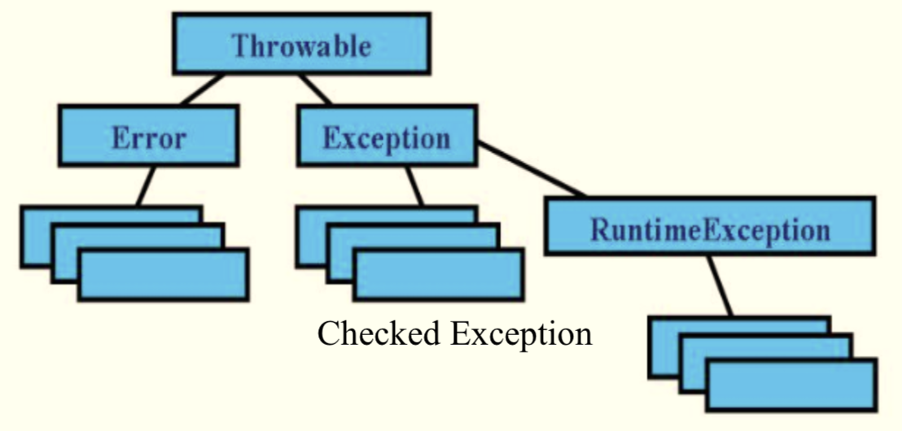

# Java基础

## Java简介

### 语言特性

+ 一种编译型语言（编译成字节码）
+ 完全面向对象的
+ 平台无关性
+ 支持多线程
+ 支持网络编程
+ 拥有最多类库的语言之一
+ 自动内存管理
+ 类只支持单继承但是可以实现多个接口

### JDK和JRE

JDK（Java Development Kit）Java开发套件。

JRE（Java Runtime Environment）Java运行时环境。

开发Java程序需要安装JDK，如果只是运行Java编写的文件，则安装JRE就足够了。

### 基本类型及其占用的bit数

Java共有8个基本类型

+ 字符类型char（16）
+ 布尔类型boolean（单boolean与int相同，boolean数组中单个boolean与byte相同）
+ 数值类型byte（8）、short（16）、int（32）、long（64）、float（32）、double（64）

### 面向对象三大特性

+ 封装
  + 隐藏对象的属性，仅向外面提供访问的接口
+ 继承
+ 多态

## 类与接口

### 区别

+ 一个类可以实现implements多个接口，但是可以extends多个接口，接口可以extends多个接口
+ 接口的方法默认是public而且不能有实现（1.8之后可以有实现），抽象类可以有非抽象的方法，抽象方法可以有public、protected、default这些修饰符。
+ 接口中只能存在static、final的变量
+ 抽象是对类的抽象，接口是对行为的抽象。

## 字符串

### 类型

+ String
+ StringBuffer
+ StringBuilder

String中的字符串是final的无法修改，可以修改指向的字符串常量。

String和StringBuffer是线程安全的，但StringBuffer的效率会低于StringBuilder。

## 包（Package）

### 包的作用

包的出现是为了更好的组织类。

相关的类和接口可以组织到一个包里

同名的类可以组织到不同的包里来区分

包访问权限

### 包的导入

+ 全部导入
  + import java.util.*;（不推荐）

+ 导入具体的
  + import java.util.Arrays;（推荐）
+ 静态导入
  + import static java.lang.Math.PI; double r = cos(PI * theta)。静态导入时不需要指定类。

### 通过包访问包的成员

x.xx y = new x.xx();

## 注解

## 异常

Error一般JVM就会终止线程

Exception中有两类，一类可检查异常，一类运行时异常。

### finally不被执行的可能情况

+ System.exit()

## 泛型

## 枚举

## 序列化

实现序列化需要 implements Serializable

如果有不想要序列化的字段可以用transient

## Lambda表达式（包含流行的Stream）

## 反射

可以使用e.getClass()或者Class.forName(className)来获取Class对象

