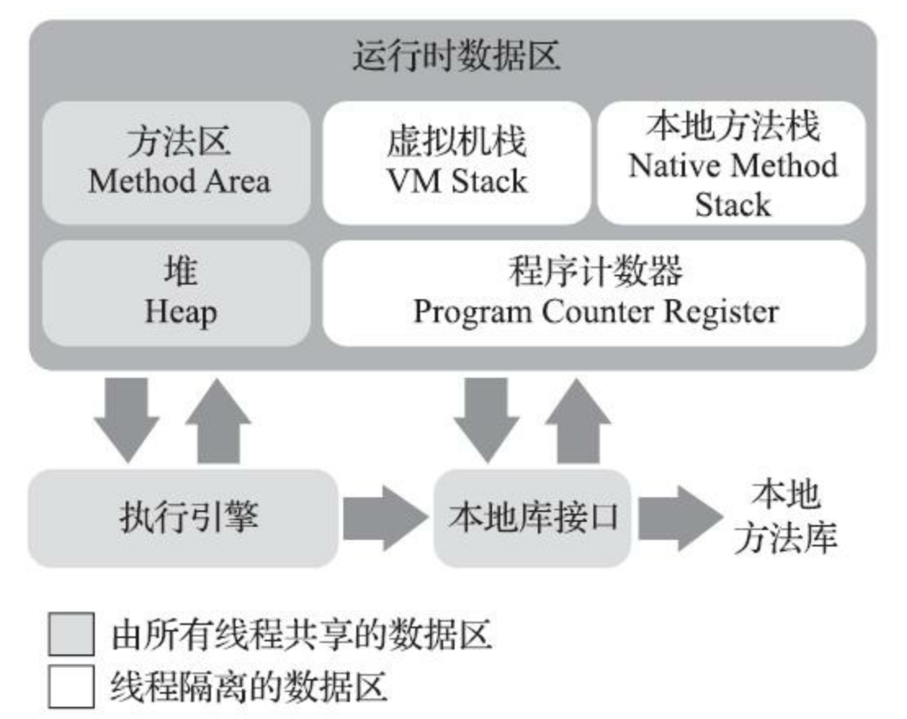

# Java内存区域与内存溢出异常

## Java内存区域

### Java内存各区域简介

+ 程序计数器

  + 学习过操作系统或者计算机组成原理的同学应该都明白，大致就相当于PC寄存器。
  + 程序计数器保存着下一条需要执行的字节码指令。
  + 每条线程都有自己独立的程序计数器，互不干扰。

+ Java虚拟机栈

  + 每个方法在被执行的时候，都会开辟一个栈帧。一个方法被调用到被执行完毕的过程，对应着一个栈帧从入栈到出栈。学习过《深入理解计算机系统》的小伙伴对这块应该会比较熟悉。
  + 申请栈成功就不会OOM(OutOfMemoryError)，但是申请到栈空间用完会有StackOverFlowError异常。如果申请栈空间的时候就失败，还是会OOM的。

+ 本地方法栈

  + 本地方法是虚拟机使用到的本地(Native)方法。

+ Java堆

  + Java堆是这几个内存区域中需要重点关注的部分，是垃圾收集器管理的内存区域。

  + 现代垃圾收集器往往是分代收集。
  
  + 如果Java堆无法再扩展时，会抛OOM异常。

+ 方法区

  + 方法区是各个线程共享的区域。主要用于存储类型信息，常量，静态变量，即时编译器编译后的代码缓存等数据。

  + JDK7中将字符串常量池、静态变量等移出。
  + JDK8中所有的内容都转移到了元空间(Meta-Space)中。
  + 如果方法区无法满足内存分配需求，将抛出OOM错误。

+ 运行时常量池(方法区的一部分)

  + Class文件中除了有类的版本、字段、方法、接口等描述信息。还有一项是常量池表，用于存放各种字面量与符号引用。
+ 直接内存
  + 直接访问内存，可能会超过物理内存限制，导致OOM。比如Java中的NIO。

## Java对象

### 对象的创建过程

+ 当Java虚拟机执行一条new语句时，会先检查能否在常量池中定位到一个类的符号引用，和该类是否已经被加载、解析和初始化过。

+ 类检查通过后，虚拟机为新生对象分配内存。对象所需的内存在类加载完成后即可确定。

+ 为新生对象分配内存的过程类似于操作系统分配内存。
+ 分配完成后Java虚拟机还要对对象进行必要的设置，例如对象指向的类，对象的哈希码，对象的GC分代年龄。
+ 对象的创建已经基本完成
+ 执行构造函数设置对象中的值

### 对象的内存分布

+ 对象存储布局可以分为三个部分：对象头，实例数据，对齐填充。

MarkWord

## 可以触发OOM的几个方法

+ Java heap space 没有空间存放新创建的对象
+ 永久代

