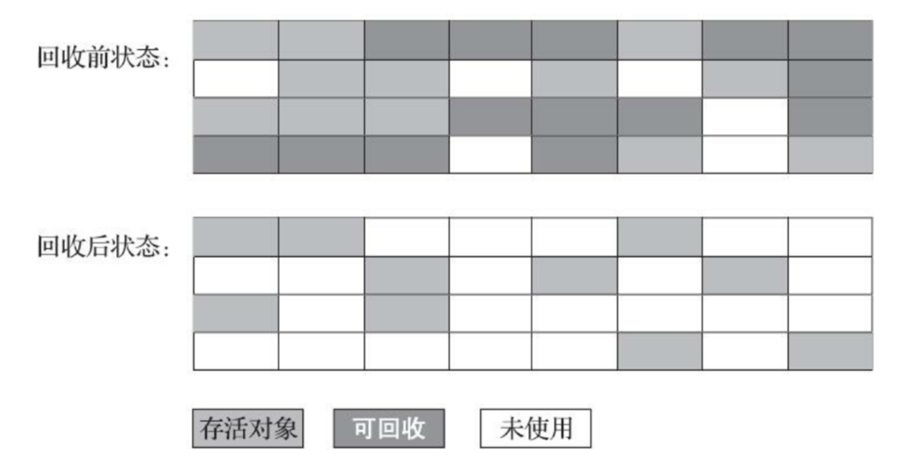
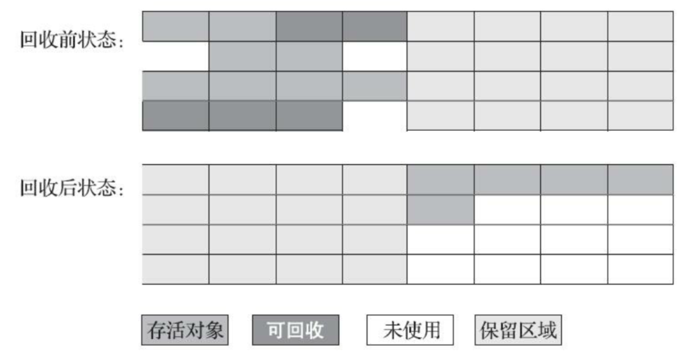
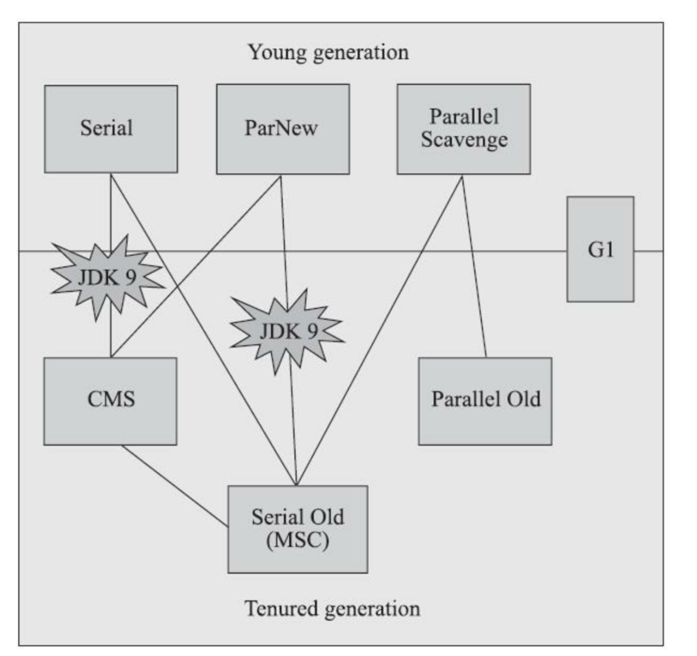

# 垃圾收集器与内存分配策略

## 概述
主要解决以下问题
+ 哪些内存需要回收
+ 什么时候回收
+ 如何回收

## 判断对象是否可以存活

### 引用计数算法
在对象中添加一个引用计数器，每当有一个地方引用就加1，少一个引用就减1。
主流的不采用引用计数法。
优点：原理简单、判断效率高。
缺点：循环引用无法判断。

### 可达性分析法
通过一系列称为GC Roots的根对象做为起始节点集。
从这些节点开始根据引用关系向下搜索，搜索过程中所走过的路径称为引用链。
如果某个对象没有引用链，则说明此对象不再被使用。

GC Root主要包括以下几类
+ 在虚拟机栈(栈帧中的本地变量表)中引用的对象，例如各个线程被调用的方法堆栈中使用到的参数、局部变量、临时变量等。
+ 在方法区中类静态属性引用的对象，例如Java类的引用类型静态变量。
+ 在方法区常量引用的对象，例如字符串常量池，例如字符串常量池里的引用。
+ 在本地方法栈中JNI(Native方法)引用的对象。
+ Java虚拟机内部的引用，如基本数据类型对应的Class对象，一些常驻内存的异常对象(比如NullPointException、OutOfMemoryError)等，还有系统类加载器。
+ 所有被同步锁(synchronized)持有的对象
+ 反应Java虚拟机内部情况的JMXBean、JVM TI中注册的回调、本地代码缓存等。

除了这些固定的之外。根据垃圾收集器的不同和当前回收区域的不同，还会有其他对象临时性加入。
比如在局部回收时，本区域的对象可能被其他区域所引用。此时关联区域的对象也会被加入GCRoots

### 引用类型

+ 强引用。最平常使用的类型。只要引用还在，垃圾收集器永远不会回收

+ 软引用。在系统将要发生内存异常钱，会把这些对象列进回收范围内进行第二次回收。使用SoftReference类实现。

+ 弱引用。只能生存到下一次垃圾收集发生为止。下一次垃圾收集开始时，都会被回收掉。WeakReference实现

+ 虚引用。为一个对象设置虚引用关联的唯一目的是为了能在这个对象被回收时收到一个系统通知。PhantomReference
虚引用主要是为了使得指向的对象被回收时可以收到通知。这时可以根据情况进行相应的处理。

### 标记不可到达后
+ 即使被标记为不可达，也不是非死不可。
+ 宣布一个对象死亡，要经历两次标记。
+ 没有引用链是第一次，第二次是是否需要执行finalize()方法
+ 在finalize()中只要重新与引用链上的任何一个对象建立关联即可。(不建议使用)

### 方法区回收
在方法区进行回收性价比是比较低的。
主要回收以下两部分：
+ 废弃的常量 
    + 如字符串"java"，没有一个字符串引用，则会被回收
+ 不再使用的类型。类型回收的条件
    + 该类的所有实例都已经被回收
    + 加载该类的类加载器都已经被回收(很难达成，除了OSGi、JSP的重加载)
    + 该类对应的java.lang.Class对象没有在任何地方被引用，无法通过反射访问该类的方法

在大量使用反射、动态代理、CGLib等字节码框架，动态生成JSP以及OSGi这类频繁自定义类加载器的场景中，通常都需要Java虚拟机具备类型卸载的能力。免得方法区有过大的内存压力。

## 垃圾收集算法

### 分代收集理论
当前的垃圾收集器一般都是分代收集。
依据存活的次数分配到不同的区域存储。
但是内存可能会有跨代引用的问题。

+ 弱分代假说：绝大多数对象都是朝生夕灭的
+ 强分代假说：经历多次GC都没有被收集的对象能存活更久
+ 跨代引用假说：跨代引用相对于同代引用来说仅占极少数(避免扫描整个老年代，而是在新生代上建立一个数据结构"记忆集"),这个数据集把老年代划分为若干小块，标识出老年代哪一块内存存在跨代引用，只扫描该区域，减少了扫描的范围）

分代收集的一些定义

+ 部分收集(Partial GC):指目标不是完整收集整个Java堆的垃圾收集
    + 新生代收集(Minor GC/Young GC):目标只是新生代的垃圾收集。
    + 老年代收集(Major GC/Old GC):目标只是老年代的垃圾收集。只有CMS才会有。
    + 混合收集(Mixed GC):目标是收集整个新生代以及部分老年代的垃圾收集。目前只有G1收集器会有这种行为。
+ 整堆收集(Full GC):收集整个Java堆和方法区的垃圾收集

### 标记-清除算法

分为两个阶段

+ 标记:标记所有需要回收的对象
+ 回收:统一回收所有被标记的对象

缺点:

+ 如果需要被回收的特别多，执行效率随着对象增常而降低
+ 内存空间碎片化，大对象可能会没有足够的连续空间存放触发GC

### 标记-复制算法

目前大多的商用Java虚拟机采用了标记-复制算法回收新生代。

将可用内存分为两块，每次只使用其中的一块。

其中一块用完了，将仍旧存活的对象复制到另一块。清理用完的内存。

优点

+ 无空间碎片，直接移动指针分配即可

缺点

+ 空间浪费，内存缩小为原先的一半

优化

+ Appel式回收，将新生代分为一块较大的Eden空间和两块Survivor，每次分配内存只使用Eden和其中一块Survivor，发生垃圾收集时，将Eden和Suvivor中仍然存活的对象一次性复制到另外一块Survivor空间。然后直接清理掉Eden和已经使用过的。默认内存大小比例8:1:1。

+ 如果存活的对象超过10%，这些对象会通过分配担保机制直接进入老年代。

### 标记-整理算法

标记存活的对象，移动到首部。

移动对象必须全程暂停用户应用程序。

关注吞吐量时可以使用。

也可以采用标记-清除和标记-整理相结合的方式，首先用标记-清除当碎片情况无法忍受时再用标记-整理来解决。

## HotSpot实现细节

上述部分介绍的都是理论部分，现在结合实际的虚拟机实现来进行分析。

## 经典垃圾收集器

