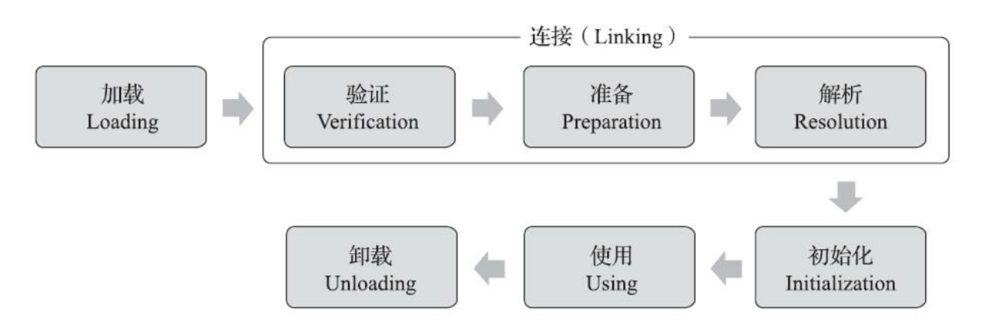

# 虚拟机类加载机制

## 概述

Class文件要被加载到虚拟机之中才能被运行和使用。

Java虚拟机把Class文件加载到内存，然后进行数据校验、转换解析和初始化，最终形成可以被虚拟机直接使用的Java类型，这个过程被称作虚拟机的类加载机制。

类型的加载、连接和初始化都是在程序运行期间完成的。

即运行期动态加载和动态连接。

## 类加载时机

加载、验证、准备、初始化和卸载这五个顺序是确认的。

解析可以在初始化之后进行。

以下6种情况必须立即对类做初始化（对类型的主动引用）。

+ 遇到new、getstatic、putstatic或invokestatic这四条字节码指令时，如果类型没有进行过初始化，则需要先出发初始化
  + 使用new实例化对象
  + 读取或设置一个类型的静态字段（被final修饰、已在编译器放入常量池的静态字段除外）
  + 调用类型的静态方法

+ 使用java.lang.reflect方法对类型进行反射调用的时候，如果类型没有进行过初始化，则需要先触发其初始化
+ 初始化类的时候，如果父类还没有初始化，则需要先触发父类的初始化
+ 虚拟机启动时，主要指定包含main()一个方法执行，虚拟机会先初始化这个类
+ 当使用JDK7新加入的动态语言支持时，如果一个java.lang.invoke.MethodHandle实例最后的解析结果为REF_getStatic、REF_putStatic、REF_invokeStatic、REF_newInvokeSpecial四种类型的方法句柄。
+ 当一个接口中定义了JDK8新加入的默认方法（被default关键字修饰的接口方法），如果有这个接口的视实现类发生了初始化，那该接口要在其之前被初始化。

被动引用的几个例子

+ 通过子类访问父类的静态变量

只会触发父类的初始化。

+ XClass[] xcls = new XClass[10]并不会触发初始化

但是会触发L+[限定名]类的初始化，代表一维数组。

+ 访问类的静态常量不会触发

类的常量会直接存储在NotInitialization的常量池中

接口与类不同的地方是接口初始化时，并不要求其父接口完成了初始化，只有使用到父接口时才会初始化。

## 类加载的过程

加载、验证、准备、解析和初始化

## 加载

完成以下三个步骤

+ 通过一个类的全限定名来获取定义此类的二进制字节流
  + 从ZIP压缩包获取，JAR、EAR、WAR
  + 从网络获取，比如Web Applet
  + 运行时动态生成，动态代理技术
  + 由其他文件生成，JSP生成Class文件
  + 从数据库中读取
  + 从加密文件中获取
+ 将字节流代表的静态存储结构转化成方法区的运行时数据结构
+ 在内存中生成代表这个类的java.lang.Class对象，作为方法区这个类的各种数据的访问入口

加载阶段获取类的二进制字节流的动作是开发人员可以进行操作的阶段。可以使用内置的类加载器，也可以使用自定义的类加载器（重写一个类加载器的findClass()或者loadClass()方法）。

对于数组类而言，数组类本身不通过类加载器创建，是由Java虚拟机动态构造出来。

