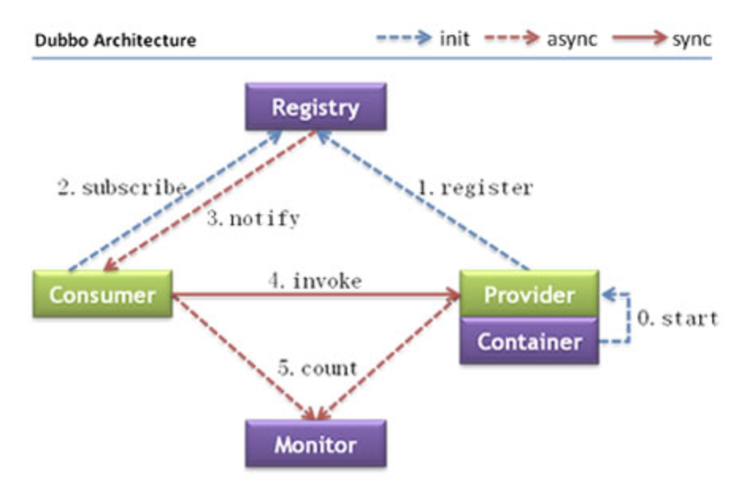

# Dubbo

## RPC

RPC（Remote Procedure Call）远程过程调用

## API与SPI

### API（Application Programming Interface）

大多数情况下，都是实现方来制定接口并完成对接口的不同实现，调用方仅仅依赖却无权选择不同实现。

### SPI（Service Provider Interface）

而如果是调用方来制定接口，实现方来针对接口来实现不同的实现，调用方来选择自己需要的实现方。

## 架构

service层由业务自定义

**各层说明**：

- **config 配置层**：对外配置接口，以 `ServiceConfig`, `ReferenceConfig` 为中心，可以直接初始化配置类，也可以通过 spring 解析配置生成配置类
- **proxy 服务代理层**：服务接口透明代理，生成服务的客户端 Stub 和服务器端 Skeleton, 以 `ServiceProxy` 为中心，扩展接口为 `ProxyFactory`
- **registry 注册中心层**：封装服务地址的注册与发现，以服务 URL 为中心，扩展接口为 `RegistryFactory`, `Registry`, `RegistryService`
- **cluster 路由层**：封装多个提供者的路由及负载均衡，并桥接注册中心，以 `Invoker` 为中心，扩展接口为 `Cluster`, `Directory`, `Router`, `LoadBalance`
- **monitor 监控层**：RPC 调用次数和调用时间监控，以 `Statistics` 为中心，扩展接口为 `MonitorFactory`, `Monitor`, `MonitorService`
- **protocol 远程调用层**：封装 RPC 调用，以 `Invocation`, `Result` 为中心，扩展接口为 `Protocol`, `Invoker`, `Exporter`
- **exchange 信息交换层**：封装请求响应模式，同步转异步，以 `Request`, `Response` 为中心，扩展接口为 `Exchanger`, `ExchangeChannel`, `ExchangeClient`, `ExchangeServer`
- **transport 网络传输层**：抽象 mina 和 netty 为统一接口，以 `Message` 为中心，扩展接口为 `Channel`, `Transporter`, `Client`, `Server`, `Codec`
- **serialize 数据序列化层**：可复用的一些工具，扩展接口为 `Serialization`, `ObjectInput`, `ObjectOutput`, `ThreadPool`

## 负载均衡

[文档](http://dubbo.apache.org/zh-cn/docs/source_code_guide/loadbalance.html)

### Random LoadBalance(默认，基于权重的随机负载均衡机制)

随机，按权重设计随机概率。

### RoundRobin LoadBalance(基于权重的轮询负载均衡机制)

在详细分析源码前，我们先来了解一下什么是加权轮询。这里从最简单的轮询开始讲起，所谓轮询是指将请求轮流分配给每台服务器。举个例子，我们有三台服务器 A、B、C。我们将第一个请求分配给服务器 A，第二个请求分配给服务器 B，第三个请求分配给服务器 C，第四个请求再次分配给服务器 A。这个过程就叫做轮询。轮询是一种无状态负载均衡算法，实现简单，适用于每台服务器性能相近的场景下。但现实情况下，我们并不能保证每台服务器性能均相近。如果我们将等量的请求分配给性能较差的服务器，这显然是不合理的。因此，这个时候我们需要对轮询过程进行加权，以调控每台服务器的负载。经过加权后，每台服务器能够得到的请求数比例，接近或等于他们的权重比。比如服务器 A、B、C 权重比为 5:2:1。那么在8次请求中，服务器 A 将收到其中的5次请求，服务器 B 会收到其中的2次请求，服务器 C 则收到其中的1次请求。

### LeastActive LoadBalance

活跃调用数越小，表明该服务提供者效率越高，单位时间内可处理更多的请求。此时应优先将请求分配给该服务提供者。在具体实现中，每个服务提供者对应一个活跃数 active。初始情况下，所有服务提供者活跃数均为0。每收到一个请求，活跃数加1，完成请求后则将活跃数减1。在服务运行一段时间后，性能好的服务提供者处理请求的速度更快，因此活跃数下降的也越快，此时这样的服务提供者能够优先获取到新的服务请求、这就是最小活跃数负载均衡算法的基本思想。除了最小活跃数，LeastActiveLoadBalance 在实现上还引入了权重值。所以准确的来说，LeastActiveLoadBalance 是基于加权最小活跃数算法实现的。举个例子说明一下，在一个服务提供者集群中，有两个性能优异的服务提供者。某一时刻它们的活跃数相同，此时 Dubbo 会根据它们的权重去分配请求，权重越大，获取到新请求的概率就越大。如果两个服务提供者权重相同，此时随机选择一个即可。

### ConsistentHash LoadBalance

- 一致性 Hash，相同参数的请求总是发到同一提供者。
- 挂掉了一台，会平摊到其他节点
- 缺省只对第一个参数 Hash
- 缺省用 160 份虚拟节点