---

---

# Charles使用教程

## 简介

当在开发APP后台的过程中，免不了与APP的开发同学进行联调。

这时候单纯的看日志进行问题定位是较为麻烦的。

使用Charles进行抓包，查看具体调用的接口和查看接口调用的返回结果是一种有效的方式。

## 教程环境

+ MacOS
+ iOS
+ Charles4.5.6

保证电脑和手机在同一网络下，各个教程的环境应该差别不大。

## Charles下载

[下载地址](https://www.charlesproxy.com/latest-release/download.do)

## Charles配置

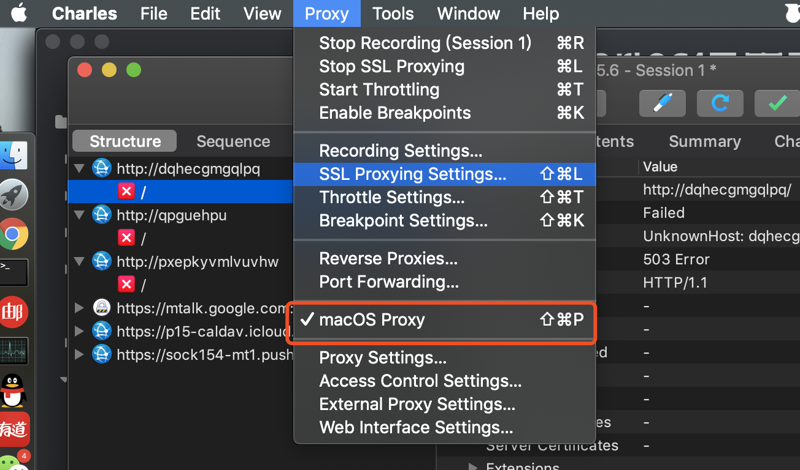

这时Charles已经可以抓取HTTP的包，这时候会发现HTTPS的包还是无法识别。

## Charles HTTPS抓包配置

+ Charles配置安装证书

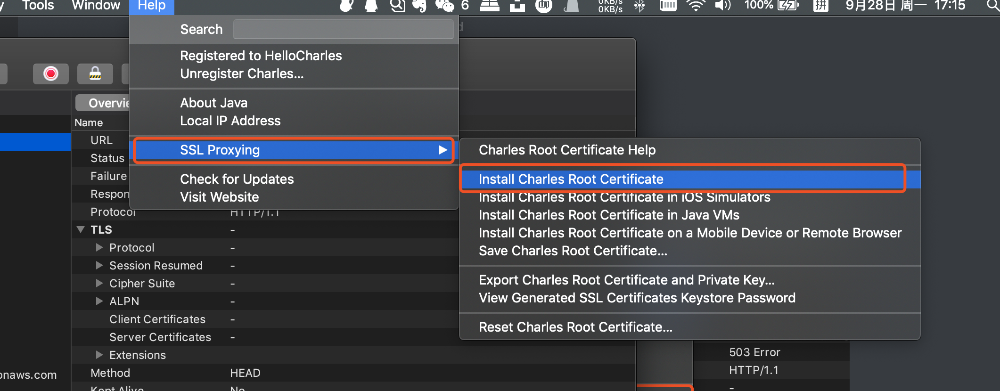

信任证书

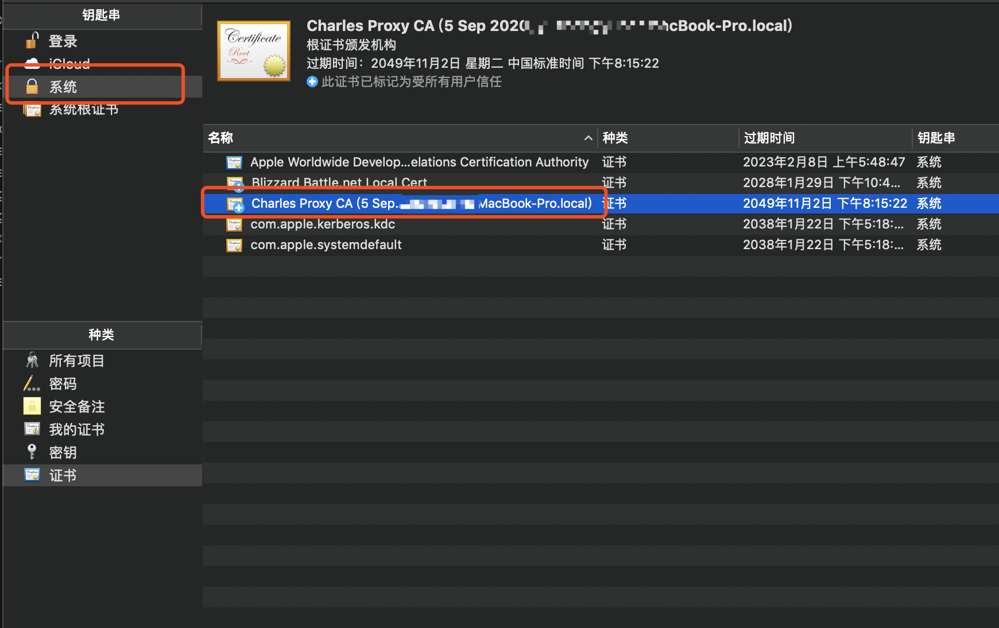

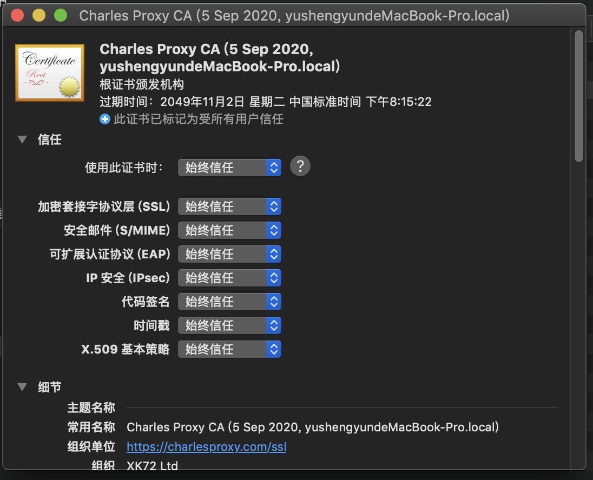

+ iOS上安装相应的CA证书

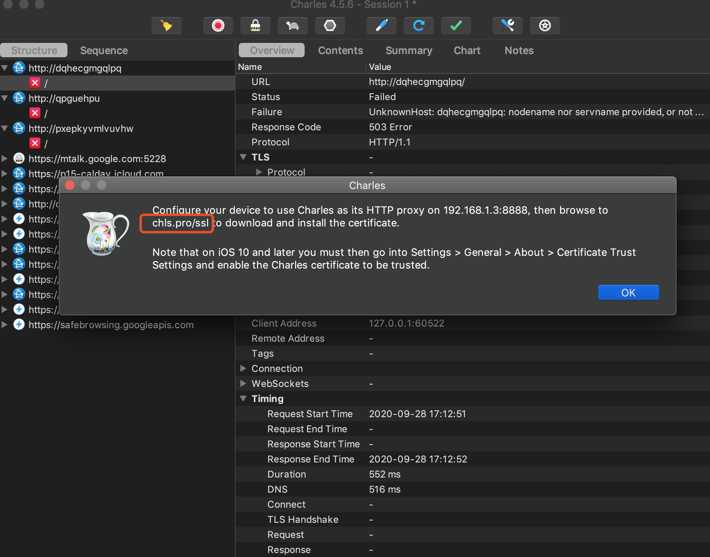

+ iOS访问chls.pro/ssl

下载证书

并且在以下两个位置信任证书

设置->通用->关于本机->证书信任设置

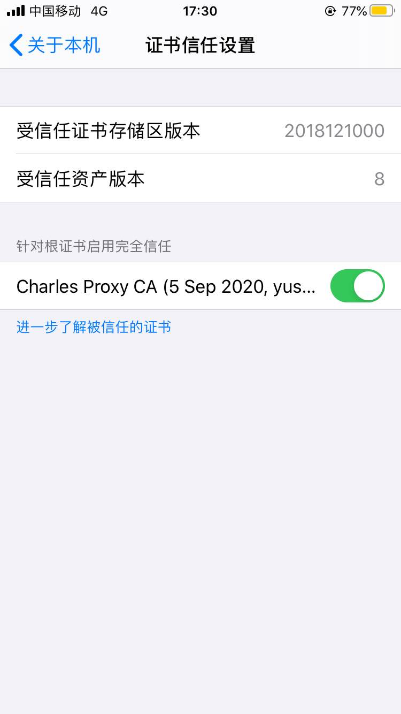

设置->通用->描述文件

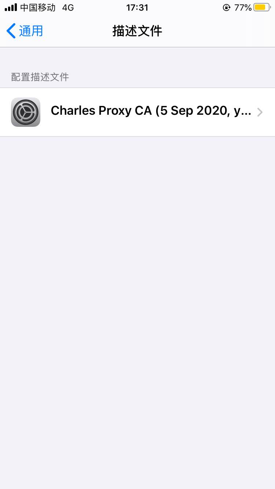

+ Charles添加需要抓取的IP

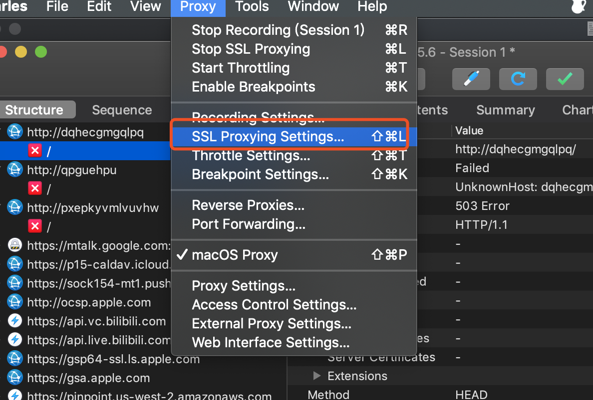

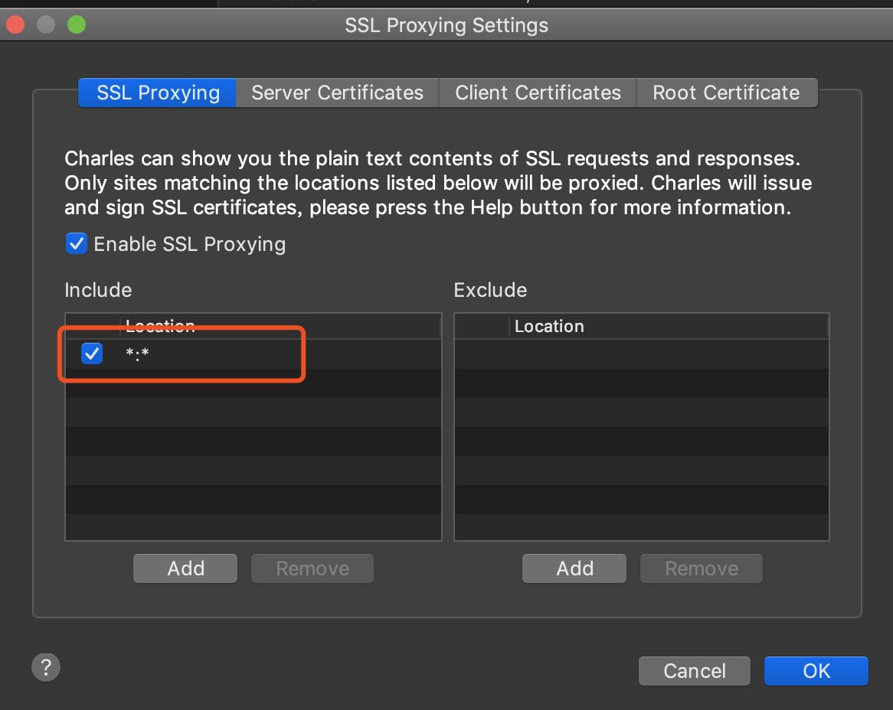

+ iOS设置代理

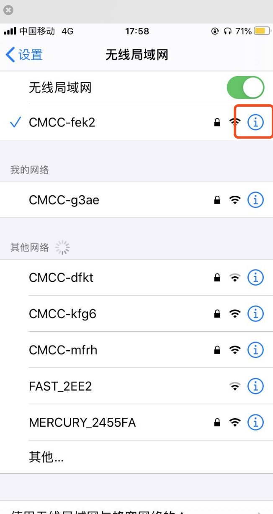

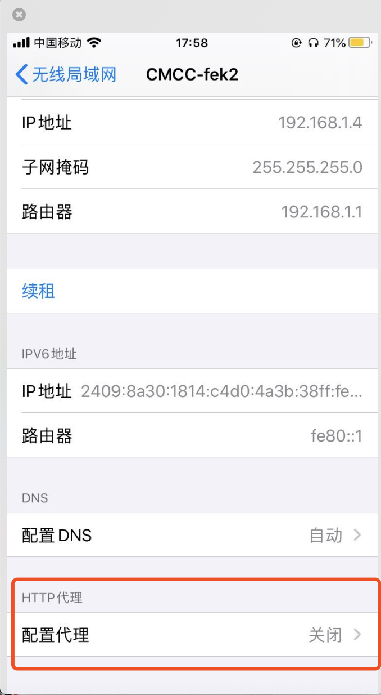

+ 填入电脑的IP和端口号

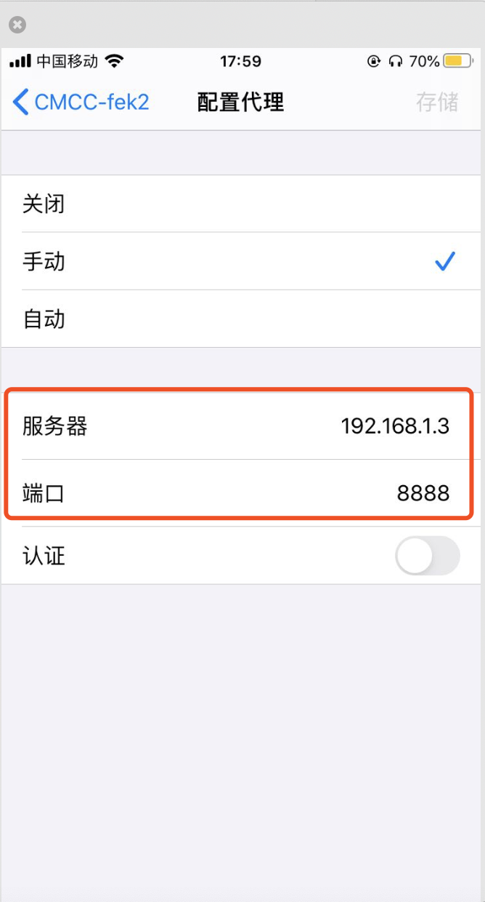

## 结束

