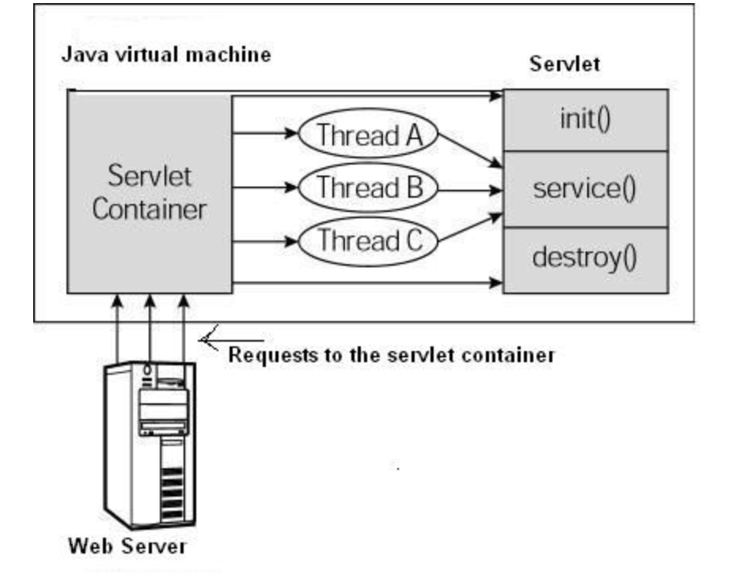

# Servlet

Java Servlet是运行在Web服务器上或应用服务器上的程序。

## Servlet生命周期

+ Servlet调用init()方法来初始化
+ Servlet调用service()方法来处理客户端的请求
+ Servlet调用destroy()方法终止
+ 最后Servet是由JVM的垃圾收集器进行回收的

### init()方法

init方法被设计只调用一次。在第一次创建Servlet的时候被调用，在后续每次用户请求

时不再被调用。

Servlet创建于用户第一次调用对应于Servlet的URL时，也可以指定在第一次启动时就被加载。

当用户调用一个Servlet时，就会创建一个Servlet实例，每一个用户请求都会产生一个新的线程。适当的时候移交给doGet或者doPost方法。init()方法简单的创建或者加载一些数据，这些数据在Servlet的整个生命周期中都会被使用。

### service()方法

service()方法是实际执行任务的主要方法。

每次服务器接收到一个Servlet请求时，服务器会产生一个新的线程并调用服务。

service()方法检查HTTP（GET、POST、PUT、DELETE等），并在适当的时候调用对应的方法。

### doGet()方法

### doPost()方法

### destroy()方法

