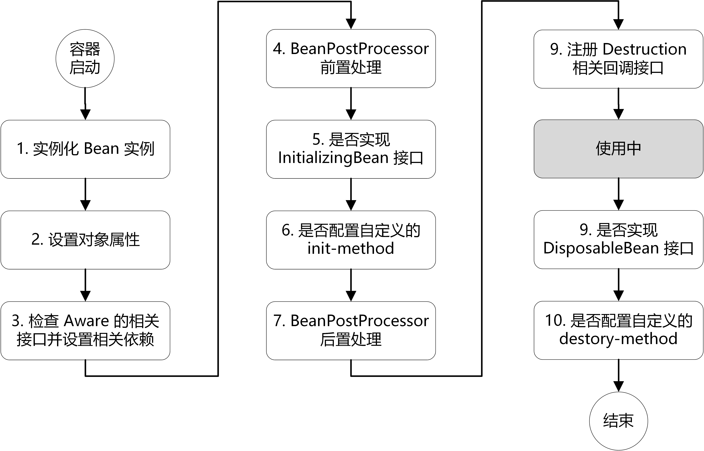

# Spring

## IOC

## Spring AOP

面向切面编程

### 定义

我们在某个地方定义通用功能，然后使用声明的方式定义这个类要以何种方式使用。而不去修改受影响的类。

横切点可以写成一个类，这些类称为切面。

### 解决的问题/好处

+ 某个功能需要在很多地方用到，但是不想在每个地方都显式去调用他。
+ 关注点可以集中在一个地方，方便修改
+ 服务模块更加简洁，通用功能写到了切面中

### 底层实现

### 常用场景

+ 登陆拦截功能
+ 日志功能

## Spring bean的生命周期

## Spring事务

## Spring 隔离级别

## Spring三种注入方式

